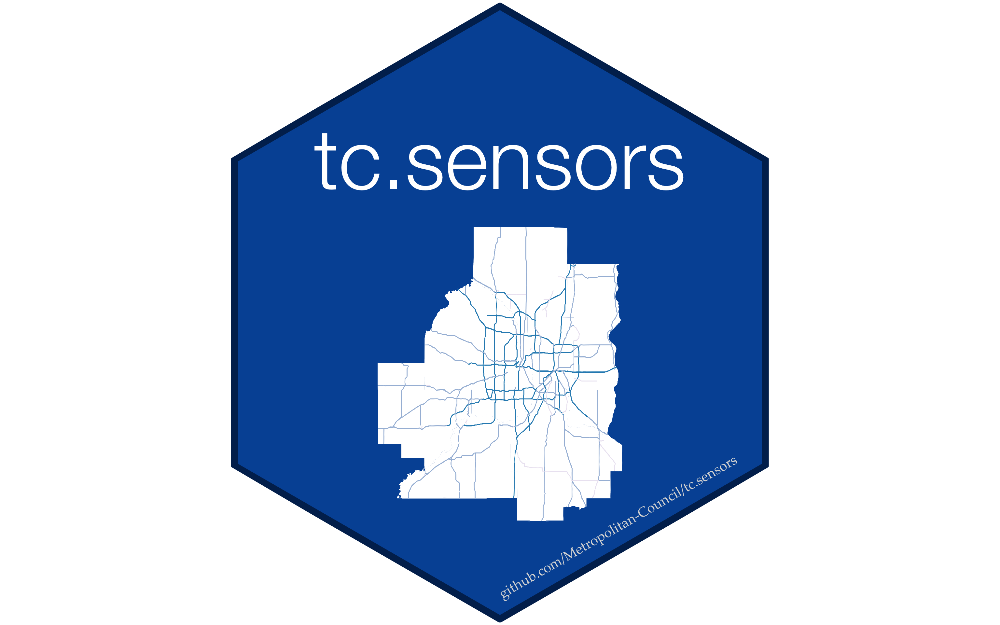

# tc.sensors

<!-- badges: start -->

[](https://github.com/Metropolitan-Council/tc.sensors/actions)
[](https://www.tidyverse.org/lifecycle/#maturing)

<!-- badges: end -->

# 

## Overview

A package for pulling data for Minnesota Department of Transportation
(MnDOT) loop detectors installed on the Minnesota Freeway system in
30-second interval measurements of occupancy and volume, data which are
pushed daily via the Mayfly API.

## Installation

``` r
remotes::install_github("Metropolitan-Council/tc.sensors")
```

## Documentation

To access documentation and for help on how to use the package, run
`?<FUNCTION-NAME>` (e.g. `?pull_sensor`, `?pull_configuration`,
`?pull_sensor_ids`). Access vignettes in the vignettes file to see
examples of end-to-end workflows for pulling and storing data locally en
masse. Check back for a vignettes for calculating speeds, reference
speeds, delay, and VMT from the resulting files.

## Relevant definitions

Definitions come from MnDOT Data Extract
[documentation](http://data.dot.state.mn.us/datatools/dataextract.html)

- **Volume** The number of vehicles that pass through a detector in a
  given time period.\
- **Occupancy** The percentage of time a detector’s field is occupied by
  a vehicle.\
- **Flow** The number of vehicles that pass through a detector per hour
  (`Volume * Samples per Hour`).\
- **Headway** The number of seconds between each vehicle
  (`Seconds_per_Hour / Flow`).\
- **Density** The number of vehicles per mile (`Flow / Speed`). See
  [full calculation
  method](http://data.dot.state.mn.us/datatools/Density.html) for
  additional context.\
- **Speed** The average speed of the vehicles that pass in a sampling
  period (`Flow / Density`).\
- **Lost/Spare Capacity** The average flow that a roadway is losing,
  either due to low traffic or high congestion, throughout the sampling
  period.
  - `Flow > 1800: 0`
  - `Density > 43: Lost Capacity: Flow - 1800`
  - `Density >= 43: Lost Capacity: 1800 - Flow`

## Associated materials and projects

- [loop-sensor-trends](https://github.com/Metropolitan-Council/loop-sensor-trends)
  Data analysis and interactive R Shiny app for examining changes in
  regional traffic levels in response to the COVID-19 pandemic.\
  <!-- - [Twin-Cities-Loop-Detectors](https://github.com/sullivannicole/Twin-Cities-Loop-Detectors) A pre-cursor to `{tc.sensors}`. Contains extensive documentation and code samples that will be integrated into this package.   -->
- [iris](https://github.com/mnit-rtmc/iris) MNIT/MnDOT repo for
  intelligent roadway information system (IRIS).
- [Mayfly API reference](https://data.dot.state.mn.us/mayfly/) The API
  through which MnDOT pushes loop detector data.

## Contributors

**Maintainer** Liz Roten (<liz.roten@metc.state.mn.us>)

[@ashleyasmus](https://github.com/ashleyasmus),
[@eroten](https://github.com/eroten),
[@SeanZhangMC](https://github.com/SeanZhangMC), and
[@sullivannicole](https://github.com/sullivannicole).

<a href="https://metrocouncil.org" target="_blank">

<div>

</div>

</a>
