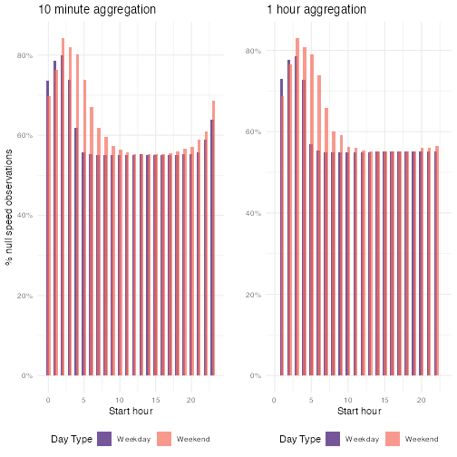
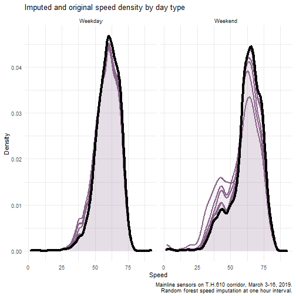
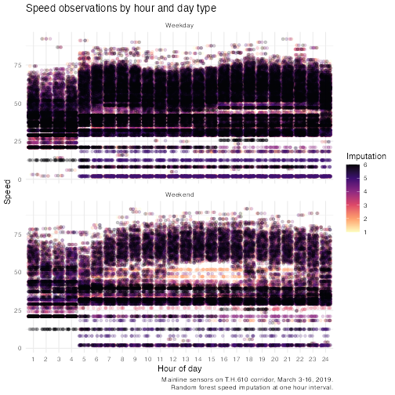
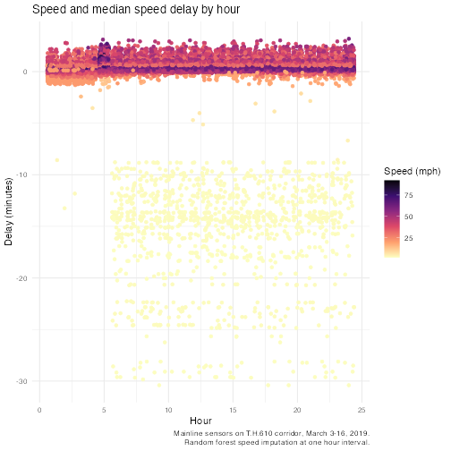

```{r, include = FALSE}
knitr::opts_chunk$set(
  collapse = TRUE,
  comment = "#>",
  eval = FALSE,
  warning = FALSE,
  message = FALSE,
  cache = TRUE
)

options(scipen = 9999)
sensor_year <- 2019
```

**Warning: the following analysis has not been peer reviewed and is subject to change at any time without notice. The analysis pulls data from a single corridor over a two week period, and is intended to illustrate this package's features. This analysis cannot be used to draw conclusions on the corridor's overall performance or the performance of the system as a whole.**

## Pull sensor data

First, we will pull the data for sensors on TH 610 from March 3 to March 16, `r sensor_year`.  

```{r message=FALSE}
library(tc.sensors)
library(tictoc)
library(dplyr)
library(ggplot2)
library(purrr)
library(furrr)
library(cowplot)
library(stringr)
library(data.table)
library(lubridate)
library(scales)
```


```{r pull-sensors, warning=FALSE}
sensor_config <- pull_configuration() %>%
  dplyr::filter(
    detector_abandoned == "f", # detectors that are NOT abandoned
    # abandoned indicates that the detector is no longer in use
    corridor_route == "T.H.610", # single out one corridor
    r_node_n_type == "Station", # only station node types
    detector_category == "" # only mainline detectors
  )

date_range <- seq(
  as.Date(paste0(sensor_year, "/03/03")), 
  as.Date(paste0(sensor_year, "/03/16")),
  by = "days")

plan(future::multisession)

tic() 
sensor_data <- future_map(
  sensor_config$detector_name,
  .f = function(det_name) {
    future_map_dfr(seq(1:length(date_range)), .f = function(x) {
      tc.sensors::pull_sensor(det_name, date_range[[x]])
    })
  }
)
toc()

```

## Clean data

The following data cleaning steps and checks are taken in `scrub_sensor()`

- Data is complete for all sensors (2,880 observations per sensor)
- Make volume and occupancy values `NA` if
    - vehicle volume >= 20 vehicles, or 2,300 vehicles per hour
    - occupancy >= 1,800 scans, or 216,000 scans per hour [^ 60 scans per second \* 60 secs per min \* 60 mins per hour = 216,000 scans per hour]
- The percentage of `NA` values is calculated for occupancy and volume. If the `NA` percentage is greater than a 10%, the values are replaced with `NA`
    - If volume or occupancy are `NA`, speed is changed to `NA`

Ongoing discussion on whether you can have valid occupancy with invalid volume, and vice versa. 

```{r clean-sensors}
clean_sensor_data <- purrr::map(
  sensor_data,
  scrub_sensor,
  interval_length = NA
)
```

## Aggregate and calculate speed  

To calculate speed and evaluate our speed calculation, we are going to look at two different aggregation intervals:  10 minutes and 60 minutes (or 1 hour). 

To avoid getting unreasonable speed values, we will set an occupancy percentage threshold at 0.002, or 0.2%. This functions somewhat like a sample size cut-off; if the occupancy is too low, its more likely that the speed value returned will be invalid. 

```{r agg-sensors}
agg_ten <- purrr::map(clean_sensor_data,
                      aggregate_sensor,
                      config = sensor_config,
                      interval_length = 10 / 60,
                      occupancy_pct_threshold = 0.002,
                      interpolate_missing = TRUE
) %>%
  purrr::map_dfr(add_day_type)

agg_hour <- purrr::map(clean_sensor_data,
                       aggregate_sensor,
                       config = sensor_config,
                       interval_length = 1,
                       occupancy_pct_threshold = 0.002,
                       interpolate_missing = TRUE
) %>%
  purrr::map_dfr(add_day_type)
```

The NA values here aren't evenly distributed across all starting hours and day types. There is a greater percentage of null values in the early morning on both weekdays and weekends, which aligns with our knowledge that there is relatively low traffic during these hours. 

```{r sensor-summary}
#> 10min speed summary
summary(agg_ten$speed)

#> 10 minute speed NA percentage
summary(agg_ten$speed)[7] / nrow(agg_ten)
#> NA's

#> 1 hour speed summary
summary(agg_hour$speed)

#> 1 hour minute speed NA percentage
summary(agg_hour$speed)[7] / nrow(agg_hour)
```

We also see this by plotting.  

```{r plot-null-obs}
cowplot::plot_grid(
  agg_ten %>%
    group_by(day_type, hour) %>%
    summarise(
      pc_n = sum(is.na(speed)) / length(speed),
      .groups = "keep"
    ) %>%
    ggplot() +
    geom_col(
      mapping = aes(
        x = hour,
        y = pc_n,
        fill = day_type
      ),
      alpha = 0.7,
      position = position_dodge(width = 0.3),
    ) +
    scale_y_continuous(labels = scales::percent) +
    scale_fill_viridis_d("Day Type", option = "magma", begin = 0.2, end = 0.7) +
    theme_minimal() +
    labs(
      y = "% null speed observations",
      x = "Start hour",
      title = "10 minute aggregation"
    ) +
    theme(legend.position = "bottom"),
  agg_hour %>%
    group_by(day_type, interval_bin) %>%
    summarise(
      pc_n = sum(is.na(speed)) / length(speed),
      .groups = "keep"
    ) %>%
    ggplot() +
    geom_col(
      mapping = aes(
        x = interval_bin,
        y = pc_n,
        fill = day_type
      ),
      position = position_dodge(width = 0.3),
      alpha = 0.7
    ) +
    scale_fill_viridis_d("Day Type", option = "magma", begin = 0.2, end = 0.7) +
    scale_y_continuous(labels = scales::percent) +
    scale_x_continuous(limits = range(agg_ten$hour)) +
    theme_minimal() +
    labs(
      y = "",
      x = "Start hour",
      title = "1 hour aggregation"
    ) +
    theme(legend.position = "bottom")
)
```
```{r, include=FALSE}
ggsave(device = "png", dpi = 72, filename = "plot_speed_nulls.png")
```
  

Next, we will plot the relationship between speed, volume, and occupancy for both aggregation levels. The plots below show that the larger interval size seems to stabilize speed values.  

```{r plot-ten-hour-agg}
plot_ten <- ggplot() +
  geom_point(
    data = agg_ten %>%
      arrange(speed),
    aes(
      y = occupancy.pct,
      x = speed,
      fill = scale(volume.sum),
      color = scale(volume.sum)
    ),
    alpha = 0.5,
    size = 3
  ) +
  scale_fill_viridis_c(stringr::str_wrap("Relative volume", 5),
                       option = "magma", aesthetics = c("fill", "color")
  ) +
  scale_y_continuous("Occupancy %",
                     labels = scales::percent,
                     limits = range(agg_ten$occupancy.pct)
  ) +
  scale_x_continuous("Speed (mph)", limits = range(agg_ten$speed)) +
  theme_minimal() +
  labs(title = "10 minute aggregation") +
  theme(legend.position = "bottom")


plot_hour <- ggplot() +
  geom_point(
    data = agg_hour %>%
      arrange(speed),
    aes(
      y = occupancy.pct,
      x = speed,
      fill = scale(volume.sum),
      color = scale(volume.sum)
    ),
    alpha = 0.5,
    size = 3
  ) +
  scale_fill_viridis_c(
    stringr::str_wrap("Relative volume", 5),
    option = "magma", aesthetics = c("fill", "color")
  ) +
  scale_y_continuous(
    "",
    labels = scales::percent,
    limits = range(agg_ten$occupancy.pct)
  ) +
  scale_x_continuous("Speed (mph)", limits = range(agg_ten$speed)) +
  theme_minimal() +
  labs(title = "1 hour aggregation") +
  theme(legend.position = "bottom")


cowplot::plot_grid(plot_ten, plot_hour)
```
```{r, include=FALSE}
ggsave(device = "png", dpi = 72, filename = "plot_occupancy_speed_volume.png")
```

## Impute missing speeds  

One option for handling `NA` values is imputation. We can use the `{mice}` package with a random forest method. A random forest model is relatively easy to understand, handles outliers well, and works with non-linear data well. The random forest also fits with what we know about how speed is dependent on factors like day type and time of day.  

```{r impute-random-forest}
library(mice)
tictoc::tic()

rf_imp_day_type <- mice(agg_hour %>% 
                          filter(!is.na(speed)),
                        method = "rf",
                        formulas = c(
                          as.formula("speed ~ volume.sum + occupancy.sum + interval_bin + day_type")
                        ),
                        maxit = 5, m = 5, print = F
)
tictoc::toc()
#> 98.71 sec elapsed
```

After we run our random forest, we are going to fetch the complete imputed data and plot the results. By fetching all the imputations, we are able to assess how the model behaves over time. 

```{r compile-imps}
all_imps <- complete(rf_imp_day_type, "all", include = T)

agg_hour_imputed <- map_dfr(seq(1, 6), .f = function(x) {
  all_imps[[x]] %>%
    mutate(imp_n = x) %>%
    select(interval_bin, speed, day_type, imp_n)
})
```

First, we will plot the speed density, taking care to examine weekdays and weekends.  

```{r plot-imputed}
ggplot() +
  geom_density(
    data = agg_hour_imputed,
    aes(
      x = speed,
      group = imp_n
    ),
    color = "plum4",
    fill = "plum4",
    alpha = 1 / 26,
    size = 1
  ) +
  geom_density(
    data = agg_hour,
    aes(x = speed),
    color = "black",
    # fill = "gray58",
    # alpha =0.5,
    size = 1.5
  ) +
  facet_wrap(~day_type) +
  labs(
    x = "Speed",
    y = "Density",
    title = "Imputed and original speed density by day type",
    caption = stringr::str_wrap(
      paste0(
        "Mainline sensors on T.H.610 corridor, March 3-16, ", sensor_year, ".
        Random forest speed imputation at one hour interval. "
      ),
      width = 60
    )
  ) +
  theme_minimal()
```

```{r, include=FALSE}
ggsave(device = "png", dpi = 72, filename = "plot_speed_imputation_density.png")
```

Next, we will look at a scatter plot of the imputed speed and hour, again, by weekday and weekend. Here, the color indicates the imputation.  

```{r plot-speed-imputed}
ggplot() +
  geom_jitter(
    data = agg_hour_imputed %>% 
      filter(speed != 0),
    mapping = aes(
      x = interval_bin, 
      y = speed,
      color = imp_n
    ),
    alpha = 0.2
  ) +
  facet_wrap(~day_type, nrow = 2) +
  scale_color_viridis_c(option = "magma", direction = -1) +
  labs(
    title = "Speed observations by hour and day type",
    x = "Hour of day",
    y = "Speed",
    color = "Imputation",
    caption = stringr::str_wrap(paste0(
      "Mainline sensors on T.H.610 corridor, March 3-16, ", sensor_year, ".
      Random forest speed imputation at one hour interval. "
    ), width = 60)
  ) +
  theme_minimal()
```


```{r, include=FALSE}
ggsave(device = "png", dpi = 72, filename = "plot_speed_imputation_hourly.png")
```

## Distance  

In order to calculate delay, we need to calculate the distance between the upstream sensor and the sensor of interest. We can accomplish this using the sensor configuration table and `add_distance()`.  

```{r config-distance}
sensor_config_distance <- tc.sensors::add_distance(sensor_config, interpolate_missing = TRUE)
```


## Delay  

*Delay* is the difference in the time it takes to traverse a given distance at the reference speed and the comparison speed. Reference speed is typically the speed during free-flow periods. Delay is highly dependent on the reference speed.  

>The use of free-flow speeds as a benchmark is understandable since it can be seen as a replicable and readily useable “objective” figure. Problems arise, however, when the difference between free flow speeds and experienced speeds are labelled “delay”. Delay is the technically correct term for the difference but is often semantically misconstrued as referring to an attainable target for peak hour travel – e.g. “zero-delay”. It should be noted that, most dynamic cities cannot afford to deliver free-flow speeds at peak hours, nor would they want to live with a road network that could deliver these speeds at peak hours. Discourse based on delay as measured in reference to free-flow travel times can thus be biased towards an unattainable and likely undesirable congestion management goal (e.g. zero delay). In this case, the use of an outcome neutral indicators or indices is preferable.  - *@world_bank_cairo_2013, Annex 9*

To calculate the amount of time (in hours) it takes to traverse a given distance, we need to know the distance length (in miles) and the speed (in miles per hour). 

$Time = \frac{Distance}{Speed}$

```{r time-test}
time_test <- complete(rf_imp_day_type) %>%
  # sample_n(1000) %>%
  left_join(sensor_config_distance %>%
              select(
                detector_name,
                distance,
                r_node_s_limit
              ), by = c("sensor" = "detector_name")) %>%
  mutate(
    travel_time_speed = dhours(distance / speed),
    travel_time_limit = dhours(distance / as.numeric(r_node_s_limit)),
    vehicle_miles_traveled = volume.sum * distance
  )

ref_speed <- time_test %>%
  ungroup() %>%
  filter(interval_bin %in% c(1:5, 20:24)) %>%
  group_by(sensor, day_type) %>%
  summarize(
    ref_time_speed = dseconds(mean(travel_time_speed)),
    ref_time_limit = dseconds(mean(travel_time_limit)),
    ref_speed = median(speed),
    .groups = "keep"
  ) %>%
  unique()
```

```{r time-compare}
time_compare <- left_join(time_test, ref_speed, by = c(
  "sensor",
  "day_type"
)) %>%
  group_by(sensor, interval_bin, day_type) %>%
  mutate(
    time_diff_speed = ref_time_speed - travel_time_speed,
    time_diff_limit = ref_time_limit - travel_time_speed,
    .groups = "keep"
  )
```

```{r plot-delay}
ggplot() +
  geom_jitter(
    data = time_compare,
    aes(
      x = interval_bin,
      y = time_diff_speed / 60,
      color = speed
    )
  ) +
  scale_color_viridis_c(option = "magma", direction = -1) +
  labs(
    title = "Speed and median speed delay by hour",
    x = "Hour",
    y = "Delay (minutes)",
    color = "Speed (mph)",
    caption = stringr::str_wrap(paste0(
      "Mainline sensors on T.H.610 corridor, March 3-16, ", sensor_year,
      ". Random forest speed imputation at one hour interval. "),
      width = 60
    )
  ) +
  theme_minimal()
```

```{r, include=FALSE}
ggsave(device = "png", dpi = 72, filename = "plot_delay_hour_speed.png")
```

## Relevant reports and references  

<div id="refs"></div>

<a href="https://metrocouncil.org" target="_blank"><div></div></a>
